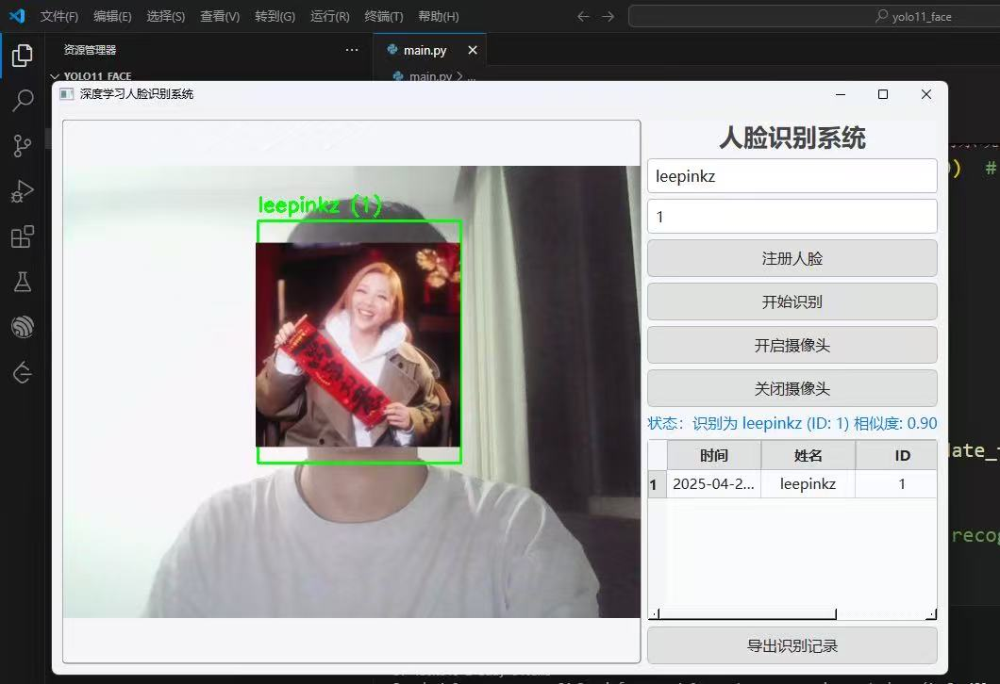

# FaceRecognition-YOLO

A real-time face recognition system based on YOLO11 and FaceNet.

## Features
- Real-time face detection and recognition
- Face registration with multiple samples
- Export recognition records
- User-friendly GUI interface
- High accuracy recognition

## Requirements
- Python 3.8+
- CUDA-capable GPU (recommended)
- Webcam

## Installation
1. Clone the repository:
```bash
git clone https://github.com/yourusername/FaceRecognition-YOLO.git
cd FaceRecognition-YOLO
```

2. Install dependencies:
```bash
pip install -r requirements.txt
```

## Usage
1. Run the application:
```bash
python main.py
```

2. Face Registration:
   - Click "Start Camera"
   - Click "Register"
   - Enter name and ID
   - Press 'R' key 5 times to capture face samples

3. Face Recognition:
   - Click "Start Camera"
   - Click "Recognize"
   - The system will automatically recognize faces

4. Export Records:
   - Click "Export" to save recognition records as CSV

## Interface


The interface includes:
- Camera display area
- Registration form
- Recognition results table
- Control buttons

## Project Structure
- `main.py`: Main application file containing the GUI implementation and face recognition logic
- `face_app.ui`: Qt Designer UI file defining the application interface
- `yolo11_face.pt`: Pre-trained YOLO11 model weights for face detection
- `face_embeddings.json`: Database file storing registered face embeddings
- `test_yolo.py`: Test script for YOLO face detection functionality
- `requirements.txt`: Python package dependencies
- `README.md`: Chinese documentation
- `README_EN.md`: English documentation
- `LICENSE`: MIT License file

## License
This project is licensed under the MIT License - see the [LICENSE](LICENSE) file for details. 